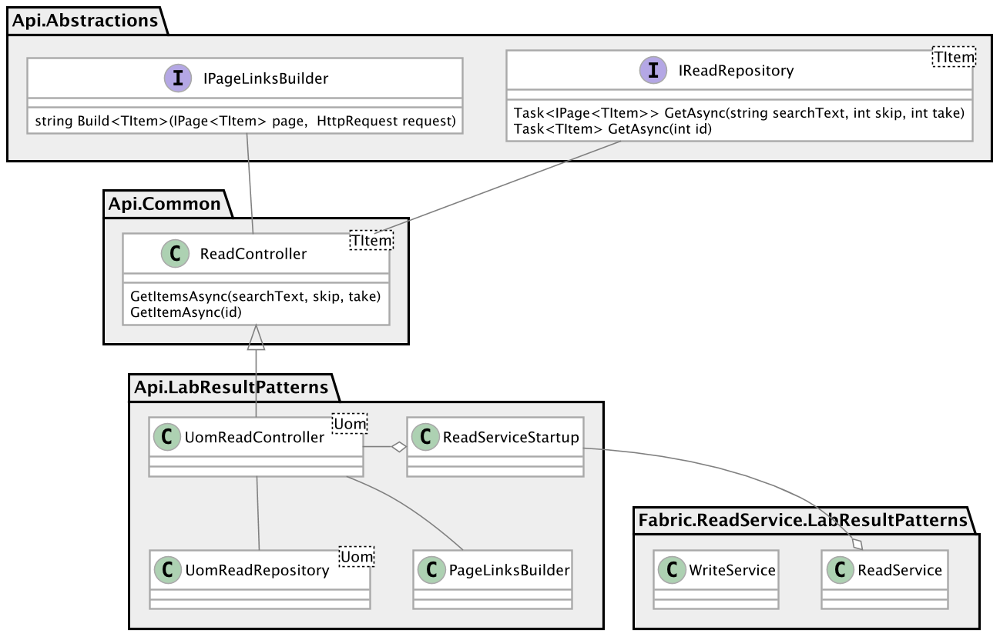

# Lab Result Patterns Manager

The Lab Results Pattern manager (*LRP* pronounced *Lerp*) is a new application that allows medical clinicians to capture and maintain a library of lab result patterns. It is one component in a larger suite of <a href="https://en.wikipedia.org/wiki/Clinical_pathway">Clinical Pathway Management</a> automation software. 

The version of *LRP* in this public repo is the first vertical slice of the application, including

- EF-Core code-first database
- ASP.Net Core Web API 2.0 rest-based microservices
- Azure integration
	- *Service Fabric* cluster deployment for ASP.Net Web API
	- *Active Directory B2C* authentication and authorization
	- *Azure SQL* database
	- *Application Insights* logging and performance monitoring
	- *ARM* deployment from Powershell
- Xamarin Forms Client with Autofac DI
- Integration testing with in-memory Sqlite and AspNetCore <a href="https://docs.microsoft.com/en-us/aspnet/core/testing/integration-testing">TestHost</a> 
- Unit testing with NUnit and Moq

A narrow but complete slice plays an important role in jump-starting an agile team's initial work on a new application.

Note that some sets of values necessary for this application, such as Azure keys and connection strings, need to be kept secret and are not commited to source control.


## In the Repo
- <a href="https://github.com/triatta/cloud/tree/pullback19/Services">Microservices</a> 
- <a href="https://github.com/triatta/cloud/tree/pullback19/ClusterSetup/ClusterSetup">Service Fabric Cluster Setup</a> 
- <a href="https://github.com/triatta/cloud/tree/pullback19/Clients">Xamarin Clients</a> 
- <a href="https://github.com/triatta/cloud/tree/pullback19/Test">Test</a> 

## Discussion
- [Introduction](#introduction)
- [Storyboard](#storyboard)
- [Database](#database)
- [Microservices](#microservices)
- [Security](#security)
- [Client](#client)
- [Testing](#testing)

### Introduction
A new application's motivation is important introductory material to orient an agile team to its users.  Here are the basic concepts behind *LRP*.

A simplified lab test result for a patient might look like this:


where

- *Name* is the name of the test
- *Value* is the test result
- *Uom* is the unit-of-measure for the result

For example, a patient's Hgb (Hemoglobin) is measured as 12.5 mg/dL.

A lab test in *LRP* looks like this:


where

- *ClinicalProperty* is an abstraction of the lab test result concept
- *Value* is removed because we are capturing the concept, not an individual result
- *Min* is the minimum value of the clinically-relevant range for this property
- *Max* is the maximum value of the clincially-relevant range for this property
- *ClinicalConstraints* are named entities that subranges for this *ClinicalProperty*, such as [Low, Normal, High]
- The *Uom* remains the unit-of-measure for the result

Now, a *Pattern* would like this:


where a *Pattern* has 1-to-many associations to distinct individual clinical constraints, each in turn associated to a particular property.

For example, <a href="https://www.mayoclinic.org/diseases-conditions/metabolic-syndrome/diagnosis-treatment/drc-20351921">*Metabolic Syndrome*</a>  is a pattern where the patient has

- A large waist circumference (>35in for women, >40in for men)
- High triglyceride level (>150 mg/dL)
- Reduced HDL (< 40 mg/dL)
- High blood pressure (> 130/85 mm Hg)
- Elevated fasting plasma glucose (> 100 mg/dL)

*LRP* facilitates creating and maintaining a large library of patterns that can be deployed in the broader suite of Clinical Pathway Management software.

### Storyboard
Here is the annotated <a href="ReadmeResources/LprStoryboard.pdf">*LRP* Storyboard PDF</a>.  (The Storyboard is a very large high-resolution single-page document.  To view it in all of its detail, use the link and then click *Download* to view the PDF locally.)

A storyboard is a good place to start to understand the topography of an application from the user's vantage.  The *LRP* storyboard shows 

- The Azure *Active Directory B2C* Login window
- The *LRP* *Home* view with access to the *Uoms*, *Properties* and *Patterns* primary workflows.
- For each of these primary workflow, browsing, searching, adding, editing and deleting.
- Reusing primary collection views as selection views, for instance when picking a *Uom* for a new or edited *Property*.

### Database
*LRP* uses an EF Core code-first approach.  The DbContext for the vertical slice in this repo looks like this:
```csharp
public class PropertyContext: DbContext
{
    public PropertyContext(DbContextOptions options) : base(options)
    {
    }

    public DbSet<Uom> Uoms { get; set; }

    protected override void OnModelCreating(ModelBuilder modelbuilder)
    {
        base.OnModelCreating(modelbuilder);
		
        // informing EF about the private fields here allows
        // the Entity to be readonly elsewhere in the app
        // https://docs.microsoft.com/en-us/ef/core/modeling/backing-field
        // https://csharp.christiannagel.com/2016/11/07/efcorefields/
		
        modelbuilder.Entity<Uom>().Property(u => u.Id).HasField("_id");
        modelbuilder.Entity<Uom>().Property(u => u.Name).HasField("_name");
        modelbuilder.Entity<Uom>().Property(u => u.Description).HasField("_description");
        // most entities in LRP have a Name property
        modelbuilder.Entity<Uom>()
            .HasIndex(u => u.Name)
            .IsUnique();
    }
}
```
As noted in the comments in the PropertyContext.OnModelCreating() method, the Uoms served from the context are materialized by EF as readonly instances.

The Uom Entity looks like this:
```csharp
public class Uom : IEntity
{
    private int _id;
    private string _name;
    private string _description;

    public Uom() : this(0, string.Empty, string.Empty)
    {
    }

    [JsonConstructor] // Json.Net will use this constructor when deserializing
    public Uom
    (
        int id,
        string name,
        string description
    )
    {
        _id = id;
        _name = name;
        _description = description;
    }

    public int Id => _id;

    // LRP uses annotations to capture data validation requirements
    [Required]
    [StringLength(30, MinimumLength = 1)]
    public string Name => _name;

    [Required]
    [StringLength(100, MinimumLength = 1)]
    public string Description => _description;

    // good introduction to immutability and the 'with' methods:
    // https://blogs.msdn.microsoft.com/dotnet/2013/09/25/immutable-collections-ready-for-prime-time/
    public Uom WithId(int id)
    {
        return id == _id
            ? this
            : new Uom(id, _name, _description);
    }

    public Uom WithName(string name)
    {
        return name == _name
            ? this
            : new Uom(_id, name, _description);
    }

    public Uom WithDescription(string description)
    {
        return description == _description
            ? this
            : new Uom(_id, _name, description);
    }

    // raison d'etre: https://msdn.microsoft.com/en-us/magazine/dn166926.aspx
    // the generic write repository will call this method on every entity before adding it to the context
    // Since, Uom has no EF navigation properties, the implementation here is empty
    public void NullifyNavProps()
    {
    }
}
```

### Microservices
*LRP* microservices are supported by common and application-specific code libraries, and are targeted for deployment on the Azure Service Fabric platform, as shown in the next diagram. 



The *LRP* domain divides its microservices into Read and Write channels that facilitate horizontal scaling.  The read load that *LRP* will experience as part of the Clinical Pathway Management suite will greatly exceed its write load. On the five-node Azure Service Fabric cluster used during development, the Read services are deployed on all five nodes while the Write service is deployed on only three (see figure below).

The UML class diagram above shows that the common read controller in *LRP* has a generic parameter to specify the Entity type for this controller, as does its IReadRepository constructor parameter.  The ReadController is responsible for Page and Item requests. The ReadRepository is responsible for reading pages or items from the persistent store.  The actual controllers deployed in the running application inherit from the common controllers, supply an Entity parameter, and annotate for authorization, as shown here:

```csharp
[Authorize(Policy = "Scope")]
[Authorize(Policy = "User")]
public class UomReadController : ReadController<Uom>
{
    public UomReadController
    (
        IReadRepository<Uom> repository,
        ISupportedMedia outputFormatter,
        IPageLinksBuilder pagedResponseBuilder
    ) : base(repository, outputFormatter, pagedResponseBuilder)
    {
    }
}
````

Web API dependency injection supplies instances of the controller's constructor parameters at runtime.

The controller constructor also requires an instance of an implementer of ISupportedMedia.  A SupportedMedia instance is responsible for supplying the MediaTypes that are currently acceptable.  *LRP* uses <a href="http://www.baeldung.com/rest-versioning">Vendor-specific MediaType API versioning</a> to evolve its APIs.  If an Accept header from a Client requests a LRP MediaType that is not a currently-supported version, an ASP.Net middleware component short-circuits the request and returns a 406. Otherwise, the routing middleware, controller and output formatter all have access to an instance of SupportedMedia to accomodate responding to the request.

Finally, the ReadController<> requires an instance of IPageLinkBuilder. The PageLinkBuilder is responsible for creating the Link header returned with every page request. *LRP* uses the same approach to pagination as the <a href="https://developer.github.com/v3/guides/traversing-with-pagination/">GitHub API</a>, namely supplying a Link header in a collection read response with *self, next, prev, first* and *last* link relations as appropriate.  When browsing collections, even on mobile clients, *LRP* does not support infinite scrolling.  *LRP* does support some scrolling, but encourages the browsing user to filter with the SeearchBar at the top of every list collection view for more efficient searching.

*LRP* uses *HATEOAS* elsewhere as well.  On application launch, for instance, every *LRP* client will issue a HEAD request to the base API url to retrieve the initial links to all the read and write channel endpoints.  

As deployed on Azure Service Fabric, these endpoints sit behind an Azure Load Balancer and are addressed and accessed through the Service Fabric Reverse Proxy.  There is a ReverseProxy instance on every node, and each ReverseProxy has access to every service on every node to facilitate failover.


In turn, each service hosts an ASP.Net Web API pipeline, which routes requests to the service's controllers.


The WebApi pipeline for both the Read and Write channels uses a Startup.cs designed to facilitate integration testing (discussed below).  In particular, integration tests deploy a TestStartup that inherits from the production Startup but overrides the Azure AD B2C token implementation in favor of a test-friendly JWT implementation that does not require user-interaction for login.

### Security
The Service Fabric cluster that hosts *LRP* is accessed over SSL from outside the cluster and uses SSL within the cluster.  

*LRP* is integrated with Azure Active Directory B2C which provides Sign-up, Sign-in, password update and other features.  When a user launches *LRP*, they are presented with an OAUTH compliant browser-based login window hosted on Azure itself.  If the do not already have an account, they can create one.  When a user first creates their account, they do not have full user privileges.  Once an admin has approved their account, they are upgraded to full access. 

If they already have an upgraded account, they can authenticate on the Azure AD login screen. Once authenticated, *LRP* receives request and refresh JWTs and presents the request JWT with each each subsequent call to the *LRP* API.  The request token contains Scope claims that identify the application used to access the API and its privileges.  The request token also contain individual user claims that are read at each API endpoint controller to guard access.

### Client
Here is the Uoms CollectionPage in the UWP Client.


The user of the page can

- Tap on the Delete icon on the toolbar to display a delete icon on every row, indicating that the view is in delete mode
- Tap on the Add icon on the toolbar to navigate to an ItemPage that can create a new Uom
- Filter the list by entering text in the Searchbar
- Tap on a row in the list view to select it for editing or deletion, depending upon view mode
- Scroll through the contents of the current page
- If there is more than 1 page in the current search, page through the list with the Page Forward and Page Back icons

Here are the clases behind the page:


In the *LRP* client architecture, there is a controller and view model for every page.  The view model's data and control properties are bound to the view and drive its presentation.  The controller knows about both the page and the view model and mediates between them.  The controller listens for user interactions on the page (the domain-specific UserEvents shown in the UML above) and responds in one of two ways:

- Call a method on the view model
- Setup and navigate to another page in the workflow

For example, in the CollectionPageController show above, there is the ItemMvcBuilder. The CollectionPageController uses it to respond to a user selectiong a row to edit, or clicking Add(+) on the toolbar.  For those events, the handler will call the ItemMvcBuilder to wire a new item page MVC collaboration push the page onto the stack.  

Behind the CollectionPageViewModel is the client PagingService implementation, shown here:


### Testing

All of the tests for *LRP* are in the Test repo.  Here is a guide:

#### Unit Testing

*LRP* unit tests come in several varieties:

Test Type      | Approach    
---            | ---          
Constructor    | <a href="http://codinghelmet.com/?path=howto/constructor-tests">Coding Helmet Constructor Testing</a>
Interaction    | NUnit + Moq
State          | NUnit

#### Example: Unit testing the SaveService

The *LRP* SaveService has a simple API: *SaveItemAsync(TItem item)*.  Here is an Activity Diagram of what it needs to accomplish:


To implement its activity, the SaveService has two collaborators:


Here is its constructor:

```csharp
public SaveService
(
    IRelType<TItem> relType,
    IHttpWriteService httpWriteService,
    IValidator validator
)
{
    _relType = relType ?? throw new ArgumentNullException(nameof(relType));
    _httpWriteService = httpWriteService ?? throw new ArgumentNullException(nameof(httpWriteService));
    _validator = validator ?? throw new ArgumentNullException(nameof(validator));
}
```

#### Constructor Unit Testing

Unit testing this constructor with the utilities from *Coding Helmet* looks like this:

```csharp
[Test]
[Category("ClientSaveService")]
public void Constructor()
{
    var relType = new Mock<IRelType<Uom>>().Object;
    var httpWriteService = new Mock<IHttpWriteService>().Object;
    var validator = new Mock<IValidator>().Object;

    ConstructorTests<SaveService<Uom>>
        .For
        (
            typeof(IRelType<Uom>),
            typeof(IHttpWriteService),
            typeof(IValidator)
        )
        .Fail(new object[] { null, httpWriteService, validator }, typeof(ArgumentNullException), "Null relType.")
        .Fail(new object[] { relType, null, validator }, typeof(ArgumentNullException), "Null httpWriteService.")
        .Fail(new object[] { relType, httpWriteService, null}, typeof(ArgumentNullException), "Null validator.")
        .Succeed(new object[] { relType, httpWriteService, validator }, "Constructor args valid.")
        .Assert();
}
```

#### Interaction Unit Testing

The SaveService's activity is deterministicallly sequential and thus suitable for Moq-based interaction testing:

For instance, here is a test for the first step in the Activity:

```csharp
[Test]
[Category("ClientSaveService")]
public void SaveItemAsync_Null()
{
    SaveService<Uom> service = new ServiceTestBuilder<Uom>()
        .SetConstructor_RelType(new RelType<Uom>(RelTypes.uomr, RelTypes.uomw))
        .Validator_NotCalled()
        .HttpWriteService_NotCalled();

    Assert.ThrowsAsync<ArgumentNullException>
    (
        async () => await service.SaveItemAsync(null)
    );
}
```

And here is the test for successful completion of the activity:

```csharp
[Test]
[Category("ClientSaveService")]
public async Task SaveItemAsync_Put()
{
    var uom = new Uom().WithId(1001);
    SaveService<Uom> service = new ServiceTestBuilder<Uom>()
        .SetConstructor_RelType(new RelType<Uom>(RelTypes.uomr, RelTypes.uomw))
        .Validator_Validate_Valid(uom)
        .HttpWriteService_PutAsync_ReturnsStatusCode(uom, HttpStatusCode.NoContent);

    await service.SaveItemAsync(uom);
}
```

As you can see, *LRP* Service tests use a ServiceTestBuilder<> that provides a fluent interface to specify the behavior of all the collaborators, making for readable and maintainable tests.

#### State Unit Testing

The SaveService collaborators provide examples of straightforward state testing.  For instance, here are tests for the Validator that the SaveService uses before sending an item to the service layer.

```csharp
[Test]
[Category("Validator")]
public void NullArgument()
{
    var validator = new Validator();
    Assert.Throws<ArgumentNullException>
    (
        () => validator.Validate(null, out _)
    );
}

[Test]
[Category("Validator")]
public void ValidReturnsTrue()
{
    var uom = new Uom(0, "TheUom", "AllOfIt");
    Assert.IsTrue(new Validator().Validate(uom, out _));
}

[Test]
[Category("Validator")]
public void InvalidOneErrorInDictionary()
{
    var uom = new Uom(0, "", "AllOfIt");
    Assert.IsFalse(new Validator().Validate(uom, out var errorDictionary));
    Assert.AreEqual(1, errorDictionary.Count);
}

[Test]
[Category("Validator")]
public void InvalidTwoErrorsInDictionary()
{
    var uom = new Uom();
    new Validator().Validate(uom, out var errorDictionary);
    Assert.AreEqual(2, errorDictionary.Count);
}

[Test]
[Category("Validator")]
public void InvalidHasValueForName()
{
    var uom = new Uom(0, "", "AllOfIt");
    new Validator().Validate(uom, out var errorDictionary);
    errorDictionary.TryGetValue("Name", out var value);
    Assert.NotNull(value);
    Assert.AreEqual(1, value?.Count);
    Assert.AreEqual("The Name field is required.", value?[0]);
}

[Test]
[Category("Validator")]
public void InvalidHasValueForDescription()
{
    var uom = new Uom(0, "TheUom", "");
    new Validator().Validate(uom, out var errorDictionary);
    errorDictionary.TryGetValue("Description", out var value);
    Assert.NotNull(value);
    Assert.AreEqual(1, value?.Count);
    Assert.AreEqual("The Description field is required.", value?[0]);
}

[Test]
[Category("Validator")]
public void InvalidHasValueForNameAndDescription()
{
    var uom = new Uom(0, "", "");
    new Validator().Validate(uom, out var errorDictionary);
    errorDictionary.TryGetValue("Description", out var descriptionValue);
    Assert.NotNull(descriptionValue);
    Assert.AreEqual(1, descriptionValue?.Count);
    Assert.AreEqual("The Description field is required.", descriptionValue?[0]);
    errorDictionary.TryGetValue("Name", out var nameValue);
    Assert.NotNull(nameValue);
    Assert.AreEqual(1, nameValue?.Count);
    Assert.AreEqual("The Name field is required.", nameValue?[0]);
}
```

#### Integration Testing

Consider these two integration tests:
```csharp
[Test]
[Category("Workflow")]
public async Task AddUom()
{
    var deviceConnection = new SqliteConnection("DataSource=devicedb;Mode=Memory;Cache=Shared");
    var modelConnection = new SqliteConnection("DataSource=modeldb;Mode=Memory;Cache=Shared");
    try
    {
        new DbInitializer().Initialize(deviceConnection, GetPropertyContext, UomTestData.GetInitialData());
        new DbInitializer().Initialize(modelConnection, GetPropertyContext, UomTestData.GetInitialData());
        var testUser = GetTestUser(deviceConnection, modelConnection);

        //
        // THE TEST
        //
        await testUser.LaunchApplication();
        await testUser.ClickLoginOnLoginPage();
        await testUser.ClickUomsOnMainPage();
        await testUser.ClickAddOnUomsPage();
        await testUser.EnterNameOnUomItemPage("zzz");
        await testUser.EnterDescriptionOnUomItemPage("Sleep");
        await testUser.ClickSaveOnUomItemPage();
        await testUser.ClickBackOnUomsPage();
    }
    finally
    {
        deviceConnection.Close();
        modelConnection.Close();
    }
}

[Test]
[Category("Workflow")]
public async Task ThrashUoms()
{
    var deviceConnection = new SqliteConnection("DataSource=devicedb;Mode=Memory;Cache=Shared");
    var modelConnection = new SqliteConnection("DataSource=modeldb;Mode=Memory;Cache=Shared");
    try
    {
        new DbInitializer().Initialize(deviceConnection, GetPropertyContext, UomTestData.GetInitialData());
        new DbInitializer().Initialize(modelConnection, GetPropertyContext, UomTestData.GetInitialData());
        var testUser = GetTestUser(deviceConnection, modelConnection);
        //
        // THE TEST
        //
        await testUser.LaunchApplication();
        await testUser.ClickLoginOnLoginPage();
        await testUser.ClickUomsOnMainPage();
        await testUser.ClickBackOnUomsPage();
        await testUser.ClickUomsOnMainPage();
        await testUser.ClickPageForwardOnUomsPage();
        await testUser.ClickPageForwardOnUomsPage();
        await testUser.ClickPageForwardOnUomsPage();
        await testUser.ClickPageBackOnUomsPage();
        await testUser.ClickPageBackOnUomsPage();
        await testUser.ClickBackOnUomsPage();

        await testUser.ClickUomsOnMainPage();
        await testUser.SearchOnUomsPage("j");
        await testUser.SearchOnUomsPage("");
        await testUser.ClickBackOnUomsPage();
        await testUser.ClickUomsOnMainPage();
        await testUser.SearchOnUomsPage("i");
        await testUser.ClickBackOnUomsPage();
        await testUser.ClickUomsOnMainPage();
        await testUser.ClickDeleteOnUomsPageToolbar();
        await testUser.SelectUomItemToDelete(5);
        await testUser.ClickBackOnUomsPage();

        await testUser.ClickUomsOnMainPage();
        await testUser.ClickDeleteOnUomsPageToolbar();
        await testUser.ClickEditOnUomsPageToolbar();
        await testUser.SelectUomItemToEdit(2);
        await testUser.EnterNameOnUomItemPage("UpdatedName");
        await testUser.EnterDescriptionOnUomItemPage("UpdatedDescription");
        await testUser.ClickSaveOnUomItemPage();
        await testUser.ClickBackOnUomsPage();

        await testUser.ClickUomsOnMainPage();
        await testUser.SearchOnUomsPage("Updated");
        await testUser.SelectUomItemToEdit(0);
        await testUser.EnterNameOnUomItemPage("UpdatedAgain");
        await testUser.ClickSaveOnUomItemPage();
        await testUser.ClickBackOnUomsPage();
    }
    finally
    {
        deviceConnection.Close();
        modelConnection.Close();
    }
}
```

At a high-level, here's what's happening:  

The integration test takes place entirely in-memory, and each test run initializes itself separately from all other test runs.  At the start, two identical databases are initialized with the same data.  There is a TestUser that runs two versions of the client, one a high-level model of client behavior (known as the AppModel), the other the actual client device common code (the TestDevice). The AppModel connects to the modeldb databae, and the TestDevice connects to the devicedb database (the database names are found in the connection string *DataSource* parameter).

The TestDevice talks to the devicedb just as it would in the real application: 

- to the *LRP* API, 
- through the Web API Pipe, 
- through the *LRP* controllers
- through the *LRP* repositories
- to the devicedb  

The TestUser runs through the test step-by-step, applying each step first to the AppModel, then to the TestDevice, and at the end of each step comparing the state of the AppModel to the state of the TestDevice  The TestUser also peeks into each database after each step of the test to verify that they are identical.  Any discrepancies found throw NUnit assertions and end the test.

Here is a portion of the TestUser that shows the simple pattern followed at each step:
```csharp
public async Task LaunchApplication()
{
    // act on model
    await _appModel.LaunchApplication();
	
    // act on actual
    await _testDevice.LaunchApplication();
	
    // verify page
    await _pageCheckManager.Check(_appModel, _testDevice);
}

public async Task ClickLoginOnLoginPage()
{
    // act on model
    await _appModel.ClickLoginOnLoginPage();

    // act on actual
    await _testDevice.ClickLoginOnLoginPage();

    // verify page
    await _pageCheckManager.Check(_appModel, _testDevice);
}

public async Task ClickUomsOnMainPage()
{
    // act on model
    await _appModel.ClickUomsOnMainPage();

    // act on actual
    await _testDevice.ClickUomsOnMainPage();

    // verify page
    await _pageCheckManager.Check(_appModel, _testDevice);
}
```
Finally, here is the TestReadServiceStartup (discused below):
```csharp
public class TestReadServiceStartup : ReadServiceStartup
{
    public SqliteConnection Connection;

    public TestReadServiceStartup(IConfiguration configuration) : base(configuration)
    {
    }

    protected override void ConfigureDbContextServices(IServiceCollection services)
    {
        Connection = new SqliteConnection("DataSource=devicedb;Mode=Memory;Cache=Shared");
        services.AddDbContext<PropertyContext>(options =>
            options.UseSqlite(Connection));
    }

    protected override void ConfigureAuthenticationServices(IServiceCollection services)
    {
        services.AddAuthentication(JwtBearerDefaults.AuthenticationScheme)
            .AddJwtBearer(options => {
                options.TokenValidationParameters =
                    new TokenValidationParameters
                    {
                        ValidateIssuer = true,
                        ValidateAudience = true,
                        ValidateLifetime = true,
                        ValidateIssuerSigningKey = true,

                        ValidIssuer = JwtTokenBuilder.ValidIssuer,
                        ValidAudience = JwtTokenBuilder.ValidAudience,
                        IssuerSigningKey =
                            JwtSecurityKey.Create(JwtTokenBuilder.KeySource)
                    };
            });

        services.AddAuthorization(options =>
        {
            options.AddPolicy("User", policy => policy.RequireClaim("jobTitle", "Advanced"));
            options.AddPolicy("Scope", policy => policy.RequireClaim(Configuration["AzureAdB2C:ScopePath"], Configuration["AzureAdB2C:ScopeRequired"]));
        });
    }
}
```

Let's examine the integration test approach in more detail:

First, two separate database connections to two completely separate in-memory Sqlite databases [devicedb, modeldb] are established.   The *Cache=Shared* entry at the end of the connection string is important as it ensures that any other db connections established during the test will connect to the db of the same name.  Under the hood, the test launches the *LRP* microservices, hosted on the completely in-memory AspNetCore TestHost. The integration test Startups for the read and write channels, as seen above, override the DbContext configuration to use the *devicedb* database opened at the beginning of the test.  They also use an in-memory JWT token implementation that supplants the Azure *Active Directory B2C* implementation and obviates the need for any interaction with Azure.

The TestUser is initialized with the AppModel and the TestDevice.  The AppModel is a high level model of the client behavior that provides all the expected state for every step of the test.  The TestDevice is a thin shell that wraps the Xamarin forms common client code and uses <a href="https://github.com/jonathanpeppers/Xamarin.Forms.Mocks">Xamarin.Forms.Mocks</a> to enable emulation of actual device behavior.

In the test, each step is async await.  This assures that any and all asynchronous activity initiated during the test step is complete and that the AppModel and TestDevice are quiescent and ready for the next step.  Without this assurance, race conditions would be introduced and the test would fail to complete every time.

A small code pattern is followed to ensure no race conditions affect the tests. The pattern starts with the domain-specific events fired by pages in response to user-interactions:

```csharp
public async Task AddToolbarItemClickedAsync()
{
    if (AddWorkflowStartedEvent != null)
    {
        var tcs = new TaskCompletionSource<object>();
        AddWorkflowStartedEvent.Invoke(tcs);
        await tcs.Task;
    }
}

protected async void AddToolbarItemClicked(object sender, EventArgs args)
{
    await AddToolbarItemClickedAsync();
}
```

When a user taps the Add(+) button on the toolbar, the page calls the typical async void method in the code-behind, *async void AddToolbarItemClicked(object sender, EventArgs args)*. 

This method does not fire the event, but rather calls the *async Task AddToolbarItemClickedAsync()* method.  Since this async method returns a Task, it can be awaited.  This method immediately fires an event, but includes a new TaskCompleteSource (TCS) as the event arg.  Then it awaits the completion of the TCS before continuing.  The PageController will handle this event and only complete the TCS when the system is quiescent.

Now take a look at how the TestDevice wrapper implements methods called by the TestUser:

```csharp
private ICollectionPage<Uom> GetUomCollectionPage()
{
    // verify UomCollectionPage is visible
    Assert.AreEqual(0, Navigation.ModalStack.Count);
    var uomsPage = Navigation.NavigationStack.Last() as ICollectionPage<Uom>;
    Assert.NotNull(uomsPage);
    return uomsPage;
}

//...

public async Task ClickAddOnUomsPage()
{
    await GetUomCollectionPage().AddToolbarItemClickedAsync();
}
```

As you can see, in the integration test, the TestUser emulates the tapping of the Add(+) icon by directly calling the method that fires the TCS-laden event.

The last phase of each integration test step is a call to the PageCheckManager.  The PageCheckManager maintains a set of page checkers and, when its Check(AppModel, TestDevice) method is called, is responsible for distributing leveraging the proper checker for the currently displayed page, 

For instance, whan a CollectionPage<TItem> is the visible page, the PageCheckManager calls CollectionPageChecker<TItem>.Check(AppModel, TestDevice).  The CollectionPageChecker<> is responsible for checking the CollectionPage on the TestDevice for the correct

- Title text
- Search text
- Toolbar tool enables
- ViewCells in the ListView
- Pagebar contents
- DbContents	
	
Here is the CollectionPageChecker<>:
	
```csharp	
public class CollectionPageChecker<TItem, TCell>
    where TItem : class, IEntity
    where TCell: class
{
    protected readonly IViewCellChecker<TItem, TCell> CellChecker;
    protected Func<DbContext> GetDeviceContext;
    protected Func<DbContext> GetModelContext;
    protected Func<TItem, TItem, bool> CheckItem;

    public CollectionPageChecker
    (
        IViewCellChecker<TItem, TCell> cellChecker,
        Func<DbContext> getDeviceContext,
        Func<DbContext> getModelContext,
        Func<TItem, TItem, bool> checkItem
    )
    {
        CellChecker = cellChecker;
        GetDeviceContext = getDeviceContext;
        GetModelContext = getModelContext;
        CheckItem = checkItem;
    }

    // API template method
    public async Task Check
    (
        CollectionPageModel<TItem> expectedPage,
        CollectionPage<TItem> actualPage
    )
    {
        CheckTitleAndSearchText(expectedPage, actualPage);
        CheckToolbarEnables(expectedPage, actualPage);
        CheckViewCells(expectedPage, actualPage);
        CheckPaging(expectedPage, actualPage);
        await CheckDb();
    }

    protected void CheckTitleAndSearchText
    (
        CollectionPageModel<TItem> expectedPage,
        CollectionPage<TItem> actualPage
    )
    {
        Assert.AreEqual(expectedPage.TitleText, actualPage.Title);
        Assert.AreEqual(expectedPage.SearchText, actualPage.SearchBar.Text);
    }

    protected void CheckToolbarEnables
    (
        CollectionPageModel<TItem> expectedPage,
        CollectionPage<TItem> actualPage
    )
    {
        Assert.AreEqual(true, actualPage.AddToolbarItem.IsEnabled);
        Assert.AreEqual(true, actualPage.EditToolbarItem.IsEnabled);
        Assert.AreEqual(true, actualPage.DeleteToolbarItem.IsEnabled);
    }

    protected void CheckViewCells
    (
        CollectionPageModel<TItem> expectedPage,
        CollectionPage<TItem> actualPage
    )
    {
        var viewCells = actualPage.ViewCellsProbe;
        Assert.NotNull(viewCells);
        Assert.AreEqual(expectedPage.ExpectedPage.Items.Count, viewCells.Count);
        var expectedItems = expectedPage.ExpectedPage.Items;
        for (var i = 0; i < expectedItems.Count; i++)
        {
            var castCell = actualPage.ViewCellsProbe[i] as TCell;
            Assert.NotNull(castCell);
            CellChecker.Check(expectedPage, expectedItems[i], castCell);
        }
    }

    protected async Task CheckDb
    (
    )
    {
        using (var deviceContext = GetDeviceContext())
        using (var modelContext = GetModelContext())
        {
            var deviceDbItems = await deviceContext.Set<TItem>()
                .OrderBy(i => i.Name)
                .ToListAsync();

            var modelDbItems = await modelContext.Set<TItem>()
                .OrderBy(i => i.Name)
                .ToListAsync();

            Assert.AreEqual(modelDbItems.Count, deviceDbItems.Count);
            for(var i=0; i<modelDbItems.Count; i++)
            {
                Assert.True(CheckItem(modelDbItems[i], deviceDbItems[i]));
            }
        }
    }

    protected void CheckPaging
    (
        CollectionPageModel<TItem> expectedPage,
        CollectionPage<TItem> actualPage
    )
    {
        var actualPagebar = actualPage.Pagebar;
        var expectedPagebar = expectedPage.ExpectedPagebar;

        Assert.AreEqual(expectedPagebar.IsVisible, actualPagebar.IsVisible);
        if (actualPagebar.IsVisible)
        {
            Assert.AreEqual(expectedPagebar.PageText, actualPagebar.PagingLabel.Text);
            Assert.AreEqual(expectedPagebar.PageForwardIsVisible, actualPagebar.PageForward.IsVisible);
            Assert.AreEqual(expectedPagebar.PageForwardDisabledIsVisible, actualPagebar.PageForwardDisabled.IsVisible);
            Assert.AreEqual(expectedPagebar.PageBackIsVisible, actualPagebar.PageBack.IsVisible);
            Assert.AreEqual(expectedPagebar.PageBackDisabledIsVisible, actualPagebar.PageBackDisabled.IsVisible);
        }
    }
}
```